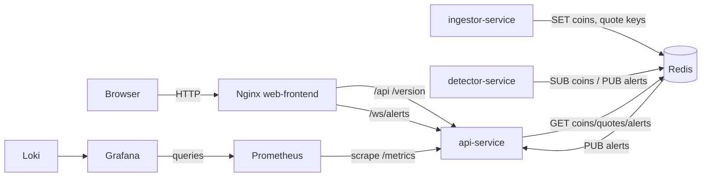

# Architecture

```mermaid
flowchart LR
  U[Browser] -->|HTTP| N[Nginx web-frontend]
  N -->|/api /version| A[api-service]
  N -->|/ws/alerts| A
  I[ingestor-service] -->|SET coins, quote keys| R[(Redis)]
  D[detector-service] -->|SUB coins / PUB alerts| R
  A -->|GET coins/quotes/alerts| R
  R -->|PUB alerts| A
  P[Prometheus] -->|scrape /metrics| A
  G[Grafana] -->|queries| P
  L[Loki] --> G
```
