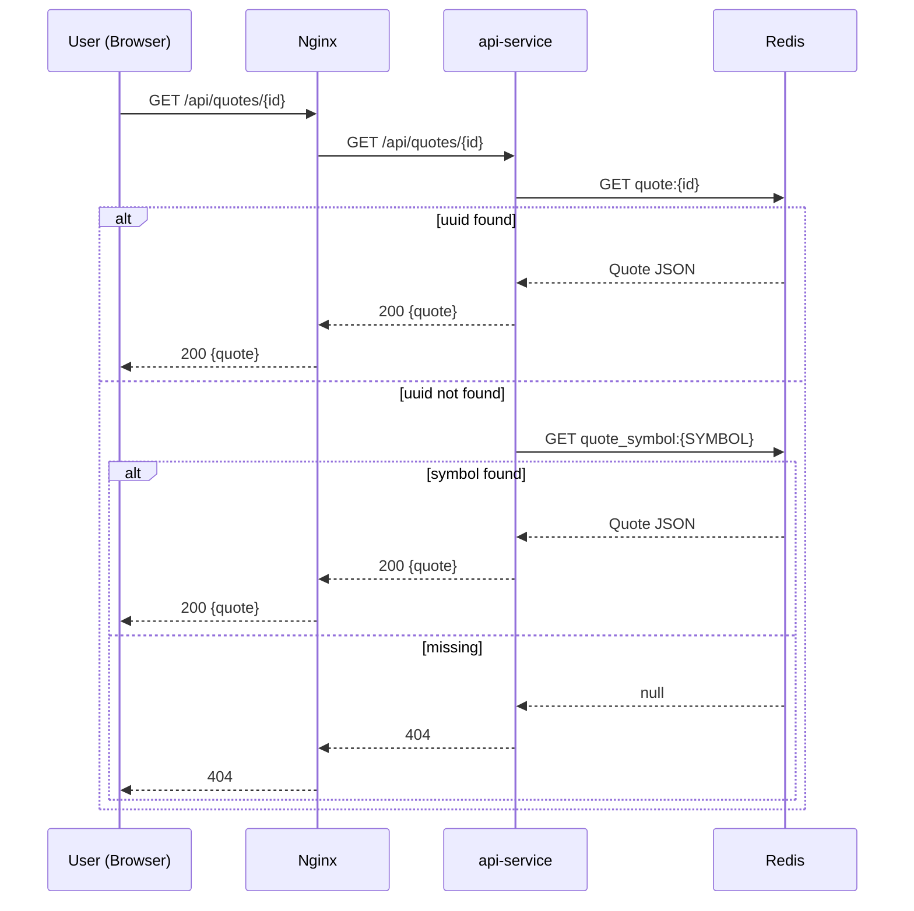
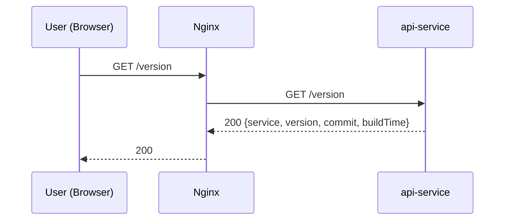

# Sequence diagrams

## Get quote by ID (uuid or symbol)

```mermaid
sequenceDiagram
  participant U as User (Browser)
  participant N as Nginx
  participant A as api-service
  participant R as Redis

  U->>N: GET /api/quotes/{id}
  N->>A: GET /api/quotes/{id}
  A->>R: GET quote:{id}
  alt uuid found
    R-->>A: Quote JSON
    A-->>N: 200 {quote}
    N-->>U: 200 {quote}
  else uuid not found
    A->>R: GET quote_symbol:{SYMBOL}
    alt symbol found
      R-->>A: Quote JSON
      A-->>N: 200 {quote}
      N-->>U: 200 {quote}
    else missing
      R-->>A: null
      A-->>N: 404
      N-->>U: 404
    end
  end
```

## Get service version

```mermaid
sequenceDiagram
  participant U as User (Browser)
  participant N as Nginx
  participant A as api-service

  U->>N: GET /version
  N->>A: GET /version
  A-->>N: 200 {service, version, commit, buildTime}
  N-->>U: 200
```
